# Crack Segmentation using U-Net

A deep learning project for automatic crack detection and segmentation using a lightweight U-Net architecture.

```mermaid
graph LR
A[📷 Input Image] --> B[🧠 U-Net Model] --> C[🎭 Segmentation Mask]
```

## Overview

This project implements semantic segmentation for detecting cracks in infrastructure images. Built with PyTorch, it uses a simplified U-Net with skip connections, trained on COCO-formatted datasets.

## Architecture

## Quick Start

bash
# Clone and install
git clone https://github.com/ghobadian/asphalt_crack_segmentation.git
cd crack-segmentation-unet
pip install -r requirements.txt

# Run the full pipeline
python src/pipeline.py

## Dataset

Expects COCO-format annotations. Place your data in `data/raw/` with `train/`, `valid/`, `test/` subfolders, each containing images and `_annotations.coco.json`.

## Configuration

| Parameter | Value |
|-----------|-------|
| Image Size | 512 × 512 |
| Batch Size | 14 |
| Epochs | 50 |
| Learning Rate | 1e-4 |

## Results

The model outputs binary segmentation masks and is evaluated using IoU (Intersection over Union).

## License

MIT License 

