# Crack Segmentation using U-Net

[](https://www.python.org/)
[](https://pytorch.org/)
[](LICENSE)

A deep learning project for automatic crack detection and segmentation in images using a lightweight U-Net architecture. This model can identify and segment cracks in infrastructure images, useful for automated structural health monitoring.


## 📋 Table of Contents

- [Overview](#overview)
- [Features](#features)
- [Architecture](#architecture)
- [Installation](#installation)
- [Dataset](#dataset)
- [Usage](#usage)
- [Pipeline](#pipeline)
- [Results](#results)
- [Project Structure](#project-structure)
- [Contributing](#contributing)
- [License](#license)

## 🔍 Overview

This project implements a semantic segmentation pipeline for detecting cracks in images. It uses a simplified U-Net architecture optimized for binary segmentation tasks. The model is trained on COCO-formatted crack detection datasets and evaluated using the Intersection over Union (IoU) metric.

```mermaid
graph LR
    A[📷 Input Image] --> B[🔧 Preprocessing]
    B --> C[🧠 U-Net Model]
    C --> D[🎭 Segmentation Mask]
    D --> E[📊 Evaluation]
    
    style A fill:#e1f5fe
    style B fill:#fff3e0
    style C fill:#f3e5f5
    style D fill:#e8f5e9
    style E fill:#fce4ec
```


## ✨ Features

- **Lightweight U-Net Architecture**: Custom encoder-decoder network with skip connections
- **Combined Loss Function**: DiceBCE loss for handling class imbalance
- **Checkpoint System**: Automatic saving and resuming of training
- **Data Pipeline**: Complete preprocessing with train/validation/test splitting
- **Evaluation Tools**: IoU metrics and visualization utilities
- **COCO Format Support**: Compatible with COCO-style annotations

## 🏗️ Architecture

### U-Net Overview

The model uses a simplified U-Net architecture with an encoder-decoder structure and skip connections:

```mermaid
flowchart TB
    subgraph Input
        A[("🖼️ Input<br/>3 × 512 × 512")]
    end
    
    subgraph Encoder["📥 Encoder Path"]
        E1["DoubleConv<br/>3 → 32"]
        E2["DoubleConv<br/>32 → 64"]
        E3["DoubleConv<br/>64 → 128"]
        P1[/"MaxPool 2×2"/]
        P2[/"MaxPool 2×2"/]
        P3[/"MaxPool 2×2"/]
    end
    
    subgraph Bottleneck["🔄 Bottleneck"]
        B["DoubleConv<br/>128 → 256"]
    end
    
    subgraph Decoder["📤 Decoder Path"]
        U3[\"UpConv 2×2"\]
        D3["DoubleConv<br/>256 → 128"]
        U2[\"UpConv 2×2"\]
        D2["DoubleConv<br/>128 → 64"]
        U1[\"UpConv 2×2"\]
        D1["DoubleConv<br/>64 → 32"]
    end
    
    subgraph Output
        O["Conv 1×1<br/>32 → 1"]
        F[("🎭 Output<br/>1 × 512 × 512")]
    end
    
    A --> E1
    E1 --> P1 --> E2
    E2 --> P2 --> E3
    E3 --> P3 --> B
    
    B --> U3 --> D3
    D3 --> U2 --> D2
    D2 --> U1 --> D1
    D1 --> O --> F
    
    E3 -.->|"Skip Connection"| D3
    E2 -.->|"Skip Connection"| D2
    E1 -.->|"Skip Connection"| D1
```


### Channel Progression


### DoubleConv Block Detail

```mermaid
flowchart LR
    subgraph DoubleConv["DoubleConv Block"]
        I[Input] --> C1["Conv2d 3×3"]
        C1 --> BN1["BatchNorm2d"]
        BN1 --> R1["ReLU"]
        R1 --> C2["Conv2d 3×3"]
        C2 --> BN2["BatchNorm2d"]
        BN2 --> R2["ReLU"]
        R2 --> O[Output]
    end
    
    style C1 fill:#fff3e0
    style C2 fill:#fff3e0
    style BN1 fill:#e3f2fd
    style BN2 fill:#e3f2fd
    style R1 fill:#ffebee
    style R2 fill:#ffebee
```


### Architecture Specifications

| Component | Input Channels | Output Channels | Output Size |
|-----------|----------------|-----------------|-------------|
| Encoder 1 | 3 | 32 | 512 × 512 |
| Encoder 2 | 32 | 64 | 256 × 256 |
| Encoder 3 | 64 | 128 | 128 × 128 |
| Bottleneck | 128 | 256 | 64 × 64 |
| Decoder 3 | 256 + 128 | 128 | 128 × 128 |
| Decoder 2 | 128 + 64 | 64 | 256 × 256 |
| Decoder 1 | 64 + 32 | 32 | 512 × 512 |
| Output | 32 | 1 | 512 × 512 |

## 🛠️ Installation

### Prerequisites

- Python 3.8+
- CUDA-compatible GPU (recommended)

### Setup

1. **Clone the repository**
   ```bash
   git clone https://github.com/ghobadian/crack-segmentation-unet.git
   cd crack-segmentation-unet
   ```

2. **Create a virtual environment**
   ```bash
   python -m venv venv
   source venv/bin/activate  # On Windows: venv\Scripts\activate
   ```

3. **Install dependencies**
   ```bash
   pip install -r requirements.txt
   ```

## 📊 Dataset

### Data Structure

This project expects data in **COCO format** with the following structure:

```mermaid
graph TD
    subgraph Dataset["📁 data/"]
        subgraph Raw["📁 raw/"]
            RT["📁 train/<br/>├── _annotations.coco.json<br/>└── *.jpg"]
            RV["📁 valid/<br/>├── _annotations.coco.json<br/>└── *.jpg"]
            RTE["📁 test/<br/>├── _annotations.coco.json<br/>└── *.jpg"]
        end
        
        subgraph Clean["📁 clean/"]
            CT["📁 train/"]
            CV["📁 valid/"]
            CTE["📁 test/"]
        end
    end
    
    Raw -->|"preprocess.py"| Clean
    
    style Raw fill:#ffebee
    style Clean fill:#e8f5e9
```


### Data Split Ratios

mermaid
pie title Dataset Split Distribution
    "Training (70%)" : 70
    "Validation (15%)" : 15
    "Test (15%)" : 15

### Supported Datasets

- [Roboflow Crack Detection Dataset](https://universe.roboflow.com/)
- Any COCO-formatted segmentation dataset

## 🚀 Usage

### 1. Preprocess Data

```python
from src.preprocess import reorganize_and_clean_dataset

reorganize_and_clean_dataset(
    source_dir='data/raw',
    target_dir='data/clean',
    train_ratio=0.7,
    val_ratio=0.15
)
```
### 2. Train the Model

```python
from src.pipeline import train_model
from src.model_architecture import SimpleUNet

model = SimpleUNet(in_channels=3, out_channels=1)
train_model(
    model=model,
    train_loader=train_loader,
    valid_loader=valid_loader,
    device='cuda',
    models_dir='models/',
    results_dir='results/',
    epochs=50
)
```
### 3. Evaluate

```python
from src.evaluate import evaluate_model, visualize_predictions

evaluate_model(model, test_loader, device)
visualize_predictions(model, test_loader, device, 'results/')
```
### Quick Start (Full Pipeline)

bash
python src/pipeline.py

## 🔄 Pipeline

### Complete Training Pipeline

```mermaid
flowchart TD
    subgraph DataPrep["1️⃣ Data Preparation"]
        A["📁 Raw Dataset<br/>(COCO Format)"] --> B["🔄 Reorganize &<br/>Clean Data"]
        B --> C["📊 Split Dataset<br/>(70/15/15)"]
        C --> D["🗂️ Create<br/>DataLoaders"]
    end
    
    subgraph Training["2️⃣ Training Phase"]
        E["🏗️ Initialize<br/>U-Net Model"] --> F["⚙️ Configure<br/>Optimizer & Loss"]
        F --> G["🔁 Training Loop"]
        G --> H{"Validation<br/>Loss Improved?"}
        H -->|Yes| I["💾 Save Best<br/>Model"]
        H -->|No| J["📈 Continue<br/>Training"]
        I --> J
        J --> K{"Epochs<br/>Complete?"}
        K -->|No| G
        K -->|Yes| L["🏁 Training<br/>Complete"]
    end
    
    subgraph Evaluation["3️⃣ Evaluation Phase"]
        M["📥 Load Best<br/>Model"] --> N["🧪 Run on<br/>Test Set"]
        N --> O["📊 Calculate<br/>IoU Score"]
        O --> P["🖼️ Generate<br/>Visualizations"]
    end
    
    D --> E
    L --> M
    
    style DataPrep fill:#e3f2fd
    style Training fill:#f3e5f5
    style Evaluation fill:#e8f5e9
```


### Loss Function: DiceBCE Loss


**Loss Formula:**

$$\mathcal{L}_{total} = \alpha \cdot \mathcal{L}_{BCE} + (1 - \alpha) \cdot \mathcal{L}_{Dice}$$

Where:
- $\mathcal{L}_{Dice} = 1 - \frac{2|P \cap T| + \epsilon}{|P| + |T| + \epsilon}$
- $\alpha = 0.5$ (default weight)

### Checkpoint System


## 📈 Results

### Training Metrics

| Metric | Value |
|--------|-------|
| IoU Score | ~0.XX |
| Training Epochs | 50 |
| Batch Size | 14 |
| Image Size | 512 × 512 |
| Learning Rate | 1e-4 |

### Model Performance Flow

```mermaid
graph TD
    subgraph Metrics["📊 Evaluation Metrics"]
        IOU["IoU Score<br/>(Intersection over Union)"]
        DICE["Dice Coefficient"]
    end
    
    subgraph Formula["📐 IoU Formula"]
        F["IoU = (Pred ∩ GT) / (Pred ∪ GT)"]
    end
    
    IOU --> F
    
    style IOU fill:#c8e6c9
    style DICE fill:#bbdefb
```


## 📁 Project Structure

```mermaid
graph TD
    subgraph Root["📁 crack-segmentation-unet/"]
        README["📄 README.md"]
        REQ["📄 requirements.txt"]
        GIT["📄 .gitignore"]
        LIC["📄 LICENSE"]
        
        subgraph Src["📁 src/"]
            INIT["__init__.py"]
            MODEL["model_architecture.py"]
            PRE["preprocess.py"]
            TRAIN["train_model.py"]
            EVAL["evaluate.py"]
            PIPE["pipeline.py"]
            CONF["config.py"]
        end
        
        subgraph Data["📁 data/"]
            DRAW["raw/"]
            DCLEAN["clean/"]
        end
        
        subgraph Models["📁 models/"]
            BEST["best_model.pth"]
            CHECK["checkpoint_*.pth"]
        end
        
        subgraph Results["📁 results/"]
            PLOT["training_loss_plot.png"]
            PRED["test_predictions.png"]
        end
    end
    
    style Src fill:#e3f2fd
    style Data fill:#fff3e0
    style Models fill:#f3e5f5
    style Results fill:#e8f5e9
```


### File Descriptions

| File | Description |
|------|-------------|
| `model_architecture.py` | U-Net model definition with DoubleConv blocks |
| `preprocess.py` | Dataset cleaning, splitting, and DataLoader creation |
| `train_model.py` | Training loop, DiceBCE loss, checkpoint handling |
| `evaluate.py` | IoU calculation and visualization utilities |
